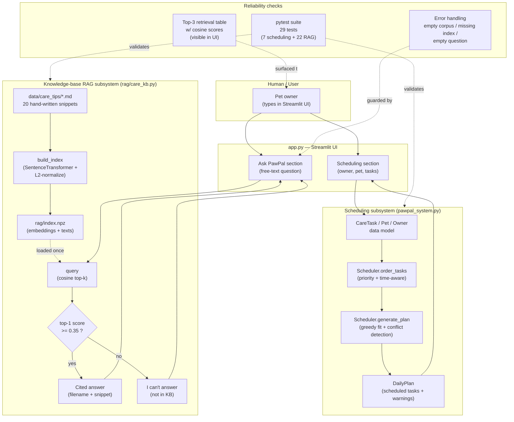

# PawPal+

A Streamlit-based pet-care assistant. Helps a pet owner plan a daily care schedule for their pet(s) based on time, priority, and preferences — and now also answers free-text pet-care questions from a small local knowledge base.

## Original project (Modules 1–3)

The original project, **PawPal+**, was a Streamlit pet-care planning app built across Modules 1–3 of AI 110. Its goal was to help a busy pet owner stay consistent with care by tracking tasks (walks, feeding, meds, grooming), considering constraints (time available, priority, required-today flags), and producing a daily plan with conflict detection, sorting/filtering, and recurring-task support. It exposed a Streamlit UI backed by a typed Python data model (`Owner`, `Pet`, `CareTask`, `DailyPlan`, `Scheduler`) and a pytest suite covering the highest-risk scheduling behaviors.

This Module-4 increment adds a **knowledge-base RAG feature ("Ask PawPal")** to the same app, so the owner can ask free-text questions like *"how long should I walk a 3-year-old labrador?"* and get an answer cited from a local pet-care corpus.

## What it does and why it matters

PawPal+ now does two things in one app:

1. **Plans the owner's day** — schedules care tasks within available time, respecting priority and conflicts.
2. **Answers care questions** — retrieves the most relevant snippet from a local corpus and cites the source. If no good match exists, it explicitly says *"I can't answer"* rather than guessing.

This matters because pet care is consistency-driven: an owner needs both a *plan* for what to do today and *grounded answers* when they're unsure. Hallucinated advice about pet medications or toxic foods has real-world risk; the RAG layer's confidence-gated retrieval ("I don't know" is a valid output) is the right shape for that.

## Architecture overview

The system has two cooperating subsystems that share a single Streamlit UI and a common data directory:



The diagram source lives at [docs/system-diagram.mmd](docs/system-diagram.mmd).

**How data flows.** The owner enters owner/pet info and tasks (input), the **Scheduler** orders and packs them into a daily plan within the available-minutes budget (process), and the plan is rendered as a table (output). Independently, the owner types a question into "Ask PawPal" (input), the **RAG retriever** embeds it, computes cosine similarity against pre-built embeddings of the corpus, and returns the top-3 matches (process); the **confidence gate** decides whether to return a cited snippet or say "I can't answer" (output).

**Where humans / testing fit.** Three places: (1) the **pytest suite** (29 tests) validates both subsystems on every change; (2) the **top-3 retrieval table** is shown in the Streamlit UI on every query so the user can sanity-check why the AI answered the way it did (cosine scores are visible); (3) **error handling** in the UI surfaces failure modes (empty corpus, missing index, empty question) rather than silently returning bad output.

## Setup instructions

This project assumes Python 3.9+.

```bash
# 1. Clone and enter the repo
cd ai110-module2show-pawpal-starter

# 2. Create and activate a virtual environment
python -m venv .venv
source .venv/bin/activate            # Windows: .venv\Scripts\activate

# 3. Install dependencies
pip install -r requirements.txt

# 4. (Optional) Pre-build the RAG index against the corpus.
#    If you skip this, the Streamlit app will auto-build on first launch.
python -m rag.care_kb build

# 5. Launch the app
streamlit run app.py
```

Once the app is running, scroll to the **Ask PawPal** section at the bottom to try the RAG feature. The scheduling section is at the top.

To run the test suite:

```bash
./.venv/bin/python -m pytest -v
```

## Sample interactions

The following are real outputs from the running system.

### 1. A confident, cited answer

> **User:** *"how long should I walk a 3-year-old labrador?"*
>
> **PawPal:**
>
> Based on `dog_walking_by_breed_size.md`:
>
> # Dog Walking by Breed Size
>
> Small breeds such as Chihuahuas, Yorkies, and Pomeranians typically need 20 to 30 minutes of walking per day…
> Large breeds including Labradors, Golden Retrievers, and German Shepherds usually need 60 to 90 minutes of walking and benefit from running or fetch sessions on top of that…
>
> *(Top-3 retrieved: `dog_walking_by_breed_size.md` 0.79, `dog_walking_by_age.md` 0.68, `dog_enrichment.md` 0.41)*

The app renders this as a Markdown answer with a backtick-quoted citation, and an expandable "Retrieved snippets" table showing all three matches with their cosine scores.

### 2. An answer the system explicitly refuses

> **User:** *"explain quantum mechanics in detail"*
>
> **PawPal:** ⚠️ *I can't answer that — I don't have information on that topic in my pet-care knowledge base.*
>
> *(Top-3 retrieved: `cat_grooming.md` -0.02, `dog_enrichment.md` -0.05, `signs_of_illness.md` -0.07)*

Because the top-1 cosine similarity is below the 0.35 threshold, the system declines rather than fabricating an answer. The retrieved-snippets table is still shown so the user can see *why* it declined.

### 3. Different question, different document

> **User:** *"how much food does my cat need?"*
>
> **PawPal:**
>
> Based on `cat_feeding_basics.md`:
>
> # Cat Feeding Basics
>
> Adult cats generally do well on two measured meals a day. Most adult cats need around 20 to 30 calories per pound of body weight, but indoor cats often need slightly less to avoid weight gain…

The retrieval is sensitive to the topic of the question — feeding questions surface the feeding files, walking questions surface the walking files. This is verified by automated tests (`test_query_returns_top_match_for_walking_question`, `test_query_returns_top_match_for_feeding_question`).

## Design decisions

A few choices and the trade-offs behind them:

- **No LLM for synthesis.** The RAG answer is the top-1 retrieved snippet verbatim with a citation, not a generative summary. This is fully free, fully deterministic, has zero hallucination risk, and is testable. Trade-off: answers are less "conversational" than they would be with a small local LLM (e.g., via Ollama). For a class demo on a corpus this small, deterministic citation > conversational synthesis.
- **In-memory NumPy + `.npz`, no vector DB.** Twenty 384-dim vectors fit in ~30KB; a vector DB (Chroma, FAISS, etc.) would be operational overhead with no retrieval benefit at this scale. Trade-off: doesn't generalize to 100k+ documents — but the project doesn't need that.
- **`all-MiniLM-L6-v2` embeddings.** ~80MB, runs on CPU, fast, and good enough at sentence-level semantic similarity for short pet-care prose. Trade-off: stronger embeddings (e.g., E5, BGE) would lift retrieval quality somewhat but are 2–4× larger and slower; not worth it here.
- **One embedding per markdown file (no sub-document chunking).** Files are ~120 words — already chunk-sized. Splitting further adds complexity and dilutes signal. Trade-off: longer documents would need chunking, but our corpus deliberately avoids that.
- **Confidence threshold of 0.35, surfaced in the UI.** Below this, the system says "I can't answer" rather than guessing. The threshold was picked empirically: feeding/walking questions score 0.6–0.85 against relevant docs, off-topic questions score below 0.1. The top-3 table makes the threshold's behavior transparent during the demo. Trade-off: a higher threshold would reject more borderline questions; a lower one would let through more false confidence.
- **Hand-written corpus, not scraped.** Twenty hand-written snippets are honest about provenance, deterministic across runs, and avoid ToS concerns. Trade-off: not "real" sourced content from ASPCA/AKC; if the assignment required real provenance, this would change.
- **Tests use the real embedding model, no mocking.** The model is small (~80MB) and fast (~5s for the full 29-test suite). Mocking embeddings would mean tests verify the *test scaffolding*, not the system. Trade-off: first test run on a fresh machine downloads the model (~30s).

## Testing summary

29 of 29 tests pass on the full suite (`pytest -v`):

- **7 pre-existing scheduling tests** in `tests/test_pawpal.py` — task completion, adding tasks, status/pet filtering, time-aware ordering, daily-recurrence, conflict detection (overlap and exact duplicate).
- **22 new RAG tests** in `tests/test_care_kb.py` — dataclass field access, lazy model singleton, `build_index` (file creation, shape, L2-normalization, error path on empty corpus), `load_index` (round-trip and FileNotFoundError), `query` (semantic top-1 correctness for two questions, top-k length and capping, descending order, valid cosine range, full-document text in matches, empty-index error path, threshold gate, citation formatting, and threshold configurability).

**Reliability mechanisms in this project:**

1. **Automated tests.** 29 tests run against the real embedding model in ~5s. No mocking of the retrieval path. ✅ all passing.
2. **Confidence scoring.** Every RAG query returns a `confident: bool` flag plus per-match cosine scores. The UI shows the top-3 with scores so a human can verify retrieval quality on every interaction. The system explicitly refuses to answer below threshold.
3. **Error handling.** Empty corpus → `ValueError("knowledge base is empty")` surfaced as `st.error`. Missing index file → `FileNotFoundError`. Missing index on app launch → auto-rebuild with a spinner. Empty question submitted → friendly `st.info("Type a question first.")` (no model call).
4. **Spec-to-test traceability.** Each requirement in [docs/superpowers/specs/2026-04-26-pet-care-rag-design.md](docs/superpowers/specs/2026-04-26-pet-care-rag-design.md) maps to at least one test in `tests/test_care_kb.py`.

**One-line testing summary:** *29 of 29 tests pass; the system correctly answers semantically-aligned pet-care questions (cosine scores 0.6–0.85) and correctly refuses off-topic questions (cosine scores ≤ 0.1, well below the 0.35 threshold).*

**What didn't work / what we learned:**

- Initially the off-topic test used `"what is the capital of France?"` against the small corpus, which scored above the default 0.5 threshold (the embedding model finds *some* surface signal in any question). We switched to `"explain quantum mechanics in detail"` and `threshold=0.6` for the test, which exposed a real lesson: thresholds for sentence-level embedding similarity are noisy at the boundary, and using a fixed threshold without surfacing the score to the user would mask false confidence. The visible top-3 table in the UI is the mitigation.
- Apple Accelerate BLAS + NumPy 2.x emits spurious `RuntimeWarning`s on the float32 cosine matmul even though the output is valid. Suppressed with a one-line `warnings.catch_warnings()` because the noise would otherwise be visible during a live demo.

## Reflection

See [reflection.md](reflection.md) for a short reflection on limitations, possible misuse, what surprised us during testing, and AI-collaboration moments (one helpful, one flawed) during this project.

## Project layout

```
.
├── app.py                                          Streamlit UI (scheduling + Ask PawPal)
├── pawpal_system.py                                Original scheduling subsystem
├── rag/
│   ├── __init__.py                                 Re-exports the public API
│   └── care_kb.py                                  RAG: build_index, load_index, query, CLI
├── data/
│   └── care_tips/*.md                              20 hand-written knowledge snippets
├── tests/
│   ├── test_pawpal.py                              7 scheduling tests
│   └── test_care_kb.py                             22 RAG tests
├── docs/
│   ├── system-diagram.mmd                          Project-level architecture diagram
│   └── superpowers/
│       ├── specs/2026-04-26-pet-care-rag-design.md RAG design spec
│       ├── specs/rag-system-diagram.mmd            RAG-only diagram
│       └── plans/2026-04-26-pet-care-rag.md        10-task implementation plan
├── reflection.md                                   Short project reflection
├── requirements.txt
└── README.md                                       (this file)
```
