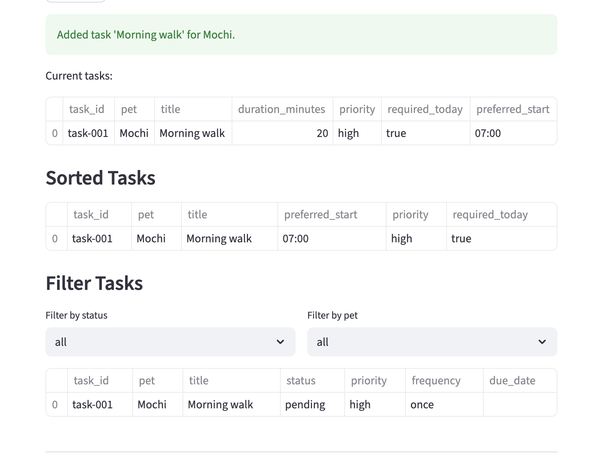

# PawPal+ (Module 2 Project)

You are building **PawPal+**, a Streamlit app that helps a pet owner plan care tasks for their pet.

## Scenario

A busy pet owner needs help staying consistent with pet care. They want an assistant that can:

- Track pet care tasks (walks, feeding, meds, enrichment, grooming, etc.)
- Consider constraints (time available, priority, owner preferences)
- Produce a daily plan and explain why it chose that plan

Your job is to design the system first (UML), then implement the logic in Python, then connect it to the Streamlit UI.

## What you will build

Your final app should:

- Let a user enter basic owner + pet info
- Let a user add/edit tasks (duration + priority at minimum)
- Generate a daily schedule/plan based on constraints and priorities
- Display the plan clearly (and ideally explain the reasoning)
- Include tests for the most important scheduling behaviors

## Smarter Scheduling

PawPal+ now includes a smarter scheduling layer in the backend:

- Time-aware ordering: tasks are sorted by preferred start time, then by required flag, priority, and duration.
- Task filtering: tasks can be filtered by completion status and by pet name.
- Recurring tasks: when a daily or weekly task is completed, the next occurrence is automatically created with the correct due date.
- Lightweight conflict detection: overlapping scheduled tasks are detected and returned as warnings instead of crashing the app.

## Features

- Greedy schedule builder: selects tasks that fit within the owner's available minutes.
- Priority-aware selection: required tasks are considered first, then high/medium/low priority, then shorter duration.
- Time-aware sorting: tasks are ordered chronologically by preferred start time (`HH:MM` parsing supported), then by required flag, priority, and duration.
- Sequential time assignment: selected tasks are placed into back-to-back scheduled blocks starting from a configured day-start time.
- Ownership validation: scheduler verifies task and pet ownership consistency before building a plan.
- Status and pet filtering: task lists can be filtered by completion status (`pending`, `completed`, `skipped`) and by pet name.
- Recurrence engine: completing `daily` or `weekly` tasks automatically generates the next occurrence with `due_date + 1 day` or `+ 7 days`.
- Conflict warnings (non-blocking): overlapping scheduled tasks are detected and returned as warnings instead of raising runtime errors.
- Scheduled-task completion by ID: completion actions target `scheduled_task_id` to avoid ambiguity when similar tasks exist.

## Getting started

### Setup

```bash
python -m venv .venv
source .venv/bin/activate  # Windows: .venv\Scripts\activate
pip install -r requirements.txt
```

### Suggested workflow

1. Read the scenario carefully and identify requirements and edge cases.
2. Draft a UML diagram (classes, attributes, methods, relationships).
3. Convert UML into Python class stubs (no logic yet).
4. Implement scheduling logic in small increments.
5. Add tests to verify key behaviors.
6. Connect your logic to the Streamlit UI in `app.py`.
7. Refine UML so it matches what you actually built.

## Testing PawPal+

Run the test suite with the project virtual environment:

```bash
./.venv/bin/python -m pytest
```

What our tests currently cover:

- Task completion status updates.
- Adding tasks to a pet.
- Filtering tasks by status and pet name.
- Sorting correctness: tasks are ordered chronologically by preferred start time.
- Recurrence logic: completing a daily task creates the next-day occurrence.
- Conflict detection: overlapping and exact duplicate-time tasks are flagged with warnings.

Confidence Level: 4/5 stars

Reasoning: the current suite passes (7/7 tests) and covers core scheduling behavior, but reliability is not yet fully proven for all edge cases (for example, weekly recurrence boundaries, invalid input handling, and larger mixed-task scheduling scenarios).

## Demo

<a href="image.png" target="_blank"></a>.

