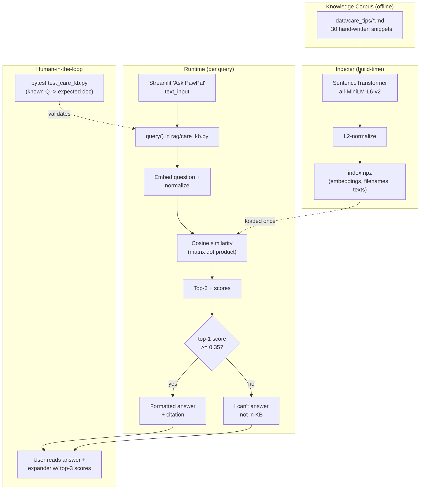

# Pet-Care Knowledge Base RAG — Design

## Goal

Add a free-text "Ask PawPal" feature to the PawPal+ Streamlit app. The user types a pet-care question (e.g., "how long should I walk a 3-year-old labrador?") and gets an answer drawn from a small local corpus, with the source file cited. If no corpus document is a confident match, the system replies "I can't answer that — I don't have information on that topic in my pet-care knowledge base."

## Stack

All free, all local. No external services at runtime.

- **Embeddings:** `sentence-transformers` with `all-MiniLM-L6-v2` (CPU, ~80MB, 384-dim).
- **Vector store:** in-memory NumPy float32 matrix; persisted as a single `.npz` file. No DB.
- **Retrieval:** cosine similarity via L2-normalized dot product.
- **Answer synthesis:** template-based (no LLM). Top-1 retrieved snippet is formatted with its filename as citation.
- **UI:** new section in the existing Streamlit `app.py`.

## Architecture

```
rag/
  __init__.py
  care_kb.py          # build_index(), load_index(), query()
  index.npz           # generated; embeddings + filenames + texts
data/
  care_tips/
    dog_walking_by_age.md
    cat_feeding_basics.md
    ...               # ~30 hand-written snippets, ~200 words each
tests/
  test_care_kb.py
docs/superpowers/specs/
  2026-04-26-pet-care-rag-design.md   # this file
```

## Components

### `rag/care_kb.py`

Three public functions plus two small dataclasses.

- `build_index(corpus_dir: Path, index_path: Path) -> None`
  Loads the embedding model, reads every `*.md` file in `corpus_dir`, embeds each file's full text as a single document, L2-normalizes the embeddings, and saves a `.npz` containing:
  - `embeddings`: float32 array, shape `[n_docs, 384]`, L2-normalized rows
  - `filenames`: string array, shape `[n_docs]`
  - `texts`: string array, shape `[n_docs]` (raw markdown content)

- `load_index(index_path: Path) -> Index`
  Loads the `.npz` and returns an `Index` dataclass holding `embeddings`, `filenames`, `texts`, and a reference to the cached model.

- `query(index: Index, question: str, top_k: int = 3, threshold: float = 0.35) -> QueryResult`
  Embeds the question, normalizes it, computes cosine similarity against `index.embeddings` via dot product, sorts descending, and returns:
  - `matches`: list of top-k `Match(filename, score, text)`
  - `confident`: `matches[0].score >= threshold`
  - `answer`: if confident, `f"Based on `{top.filename}`:\n\n{top.text.strip()}"`. Otherwise the "I can't answer" string.

### Module-level model cache

```python
_MODEL = None

def _get_model():
    global _MODEL
    if _MODEL is None:
        _MODEL = SentenceTransformer("all-MiniLM-L6-v2")
    return _MODEL
```

This survives Streamlit reruns within a single Python process.

## Data flow

### Index build (one-time / on corpus change)

```
data/care_tips/*.md
  → read each file → one document
  → SentenceTransformer.encode() → [n_docs, 384] float32
  → L2-normalize rows
  → np.savez(rag/index.npz, embeddings, filenames, texts)
```

Triggered by either:
- CLI: `python -m rag.care_kb build`
- Auto: `app.py` calls `build_index()` on first launch if `rag/index.npz` is missing, with a `st.spinner("Building knowledge base...")`.

### Query (per user question)

```
user submits question in Streamlit
  → care_kb.query(index, question)
  → embed question → L2-normalize
  → embeddings @ q_vec  (cosine similarity, since both are unit vectors)
  → argsort descending → top-3
  → if top-1.score >= 0.35: format answer with citation
    else: "I can't answer..."
  → return QueryResult to app.py
  → render answer + expander showing top-3 (filename, score, preview)
```

## UI integration in `app.py`

A new section is appended after the schedule section (after the existing `st.divider()`).

- `st.subheader("Ask PawPal")`
- `st.text_input("Ask a pet-care question", placeholder="How long should I walk a 3-year-old labrador?")`
- `st.button("Ask")` triggers `care_kb.query()`
- Renders `result.answer` via `st.markdown` (or `st.warning` when not confident)
- `st.expander("Retrieved snippets")` shows the top-3 matches as a table: `filename | score | preview` (first 80 chars of text)

The index is loaded once via `@st.cache_resource` on a `get_index()` helper.

## Error handling

Three real failure modes; nothing else is wrapped in try/except.

- **Index missing on app launch:** auto-build with a spinner. First launch downloads the model (~80MB) and indexes the corpus (~10s).
- **Empty question submitted:** the Ask button is a no-op.
- **Corpus directory empty / index has 0 docs:** `query()` raises `ValueError("knowledge base is empty")`; the app catches and shows `st.error`.

If model inference itself crashes, let it crash with the real traceback. This is a demo app — no defensive wrapping.

## Threshold and transparency

- Bail-out threshold: cosine similarity of **0.35** for top-1.
- The top-3 retrieval table is always shown (when a query is run), with raw scores. This makes confidence visible during the demo and lets a grader see why a borderline question was accepted or rejected.

## Corpus

~30 hand-written markdown snippets in `data/care_tips/`, ~200 words each. Topics span:
- Dog walking duration by age and breed size
- Cat feeding (kittens, adults, seniors)
- Grooming frequency by coat type
- Common medications and dosing notes
- Enrichment / mental stimulation
- Dental care, nail trimming, ear cleaning
- Signs of illness, when to see a vet
- Puppy/kitten basics, senior pet care

Each file has a short topic header and a `Source: general pet-care guidelines` footer to make the citation pattern explicit.

## Testing

`tests/test_care_kb.py` — runs against the real model (it's small and fast).

- `test_build_index_creates_npz` — index file exists, `embeddings.shape == (3, 384)`.
- `test_query_returns_top_match` — ask a question semantically aligned with one of three fixture docs; assert top-1 filename is the expected one.
- `test_query_below_threshold_says_cant_answer` — ask "what's the capital of France"; assert `confident == False` and answer contains "can't answer".
- `test_query_returns_top_k_with_scores` — assert `len(matches) == k`, scores are descending, scores in `[-1, 1]`.

Fixture: 3 short hand-written `.md` files written into a `tmp_path` directory per test.

No mocking. Matches the project's existing testing posture (real Pet/Owner/Scheduler objects, no mocks in `tests/`).

## System diagram

The diagram source lives in its own file: [rag-system-diagram.mmd](rag-system-diagram.mmd). Treat it as the source of truth — when the architecture changes (components added, data flow rerouted, threshold logic moved), update the `.mmd` file in the same change.

The snippet below is rendered inline for convenience but should be kept in sync with the `.mmd` file.



Diagram coverage:
- **Components:** Indexer, Retriever (`query()` + similarity), Gate (threshold), UI, Tests.
- **Data flow:** corpus → embeddings → index → query → top-k → gate → answer/reject.
- **Human / testing checkpoints:** the demo expander surfaces retrieval scores so a human can sanity-check confidence in real time; the pytest suite is the automated evaluator that pins known-good question→document mappings.

## Dependencies to add

In `requirements.txt`:
- `sentence-transformers>=2.2`
- `numpy>=1.24`

`numpy` is a transitive dep of sentence-transformers but is named explicitly because we use it directly.

## Out of scope

- LLM-based answer synthesis (option C from brainstorming — rejected).
- Web scraping ASPCA/AKC pages (option B from brainstorming — rejected; corpus is hand-written).
- Sub-document chunking (each file is one embedding).
- Re-ranking, hybrid search, query expansion, or any other retrieval refinement.
- Persisting query history or per-user state.
